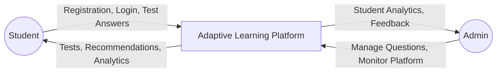
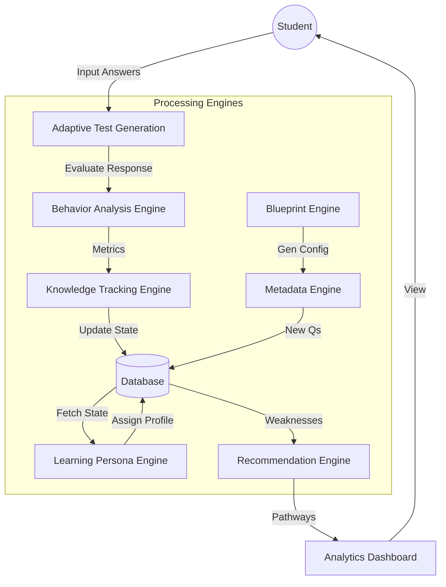
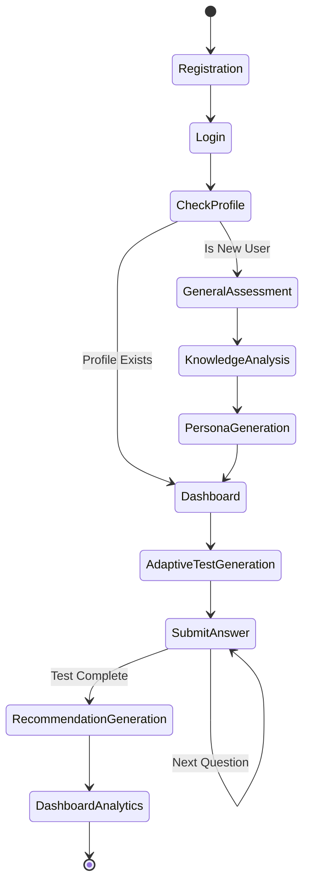
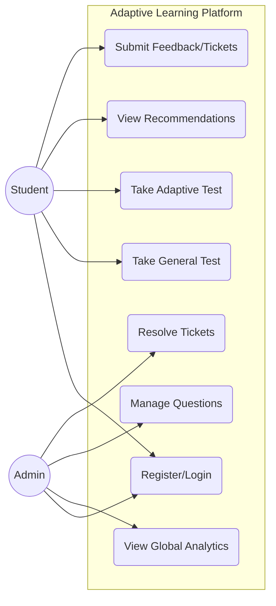
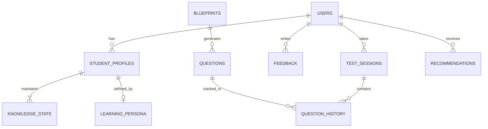
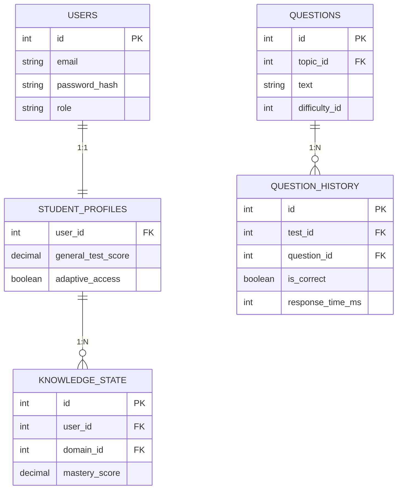
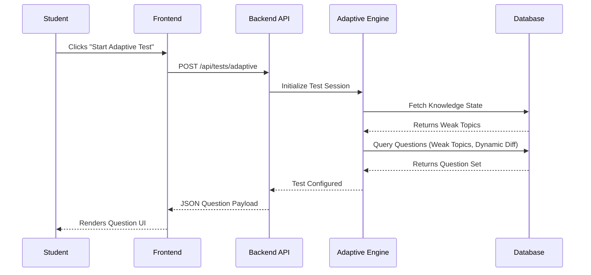
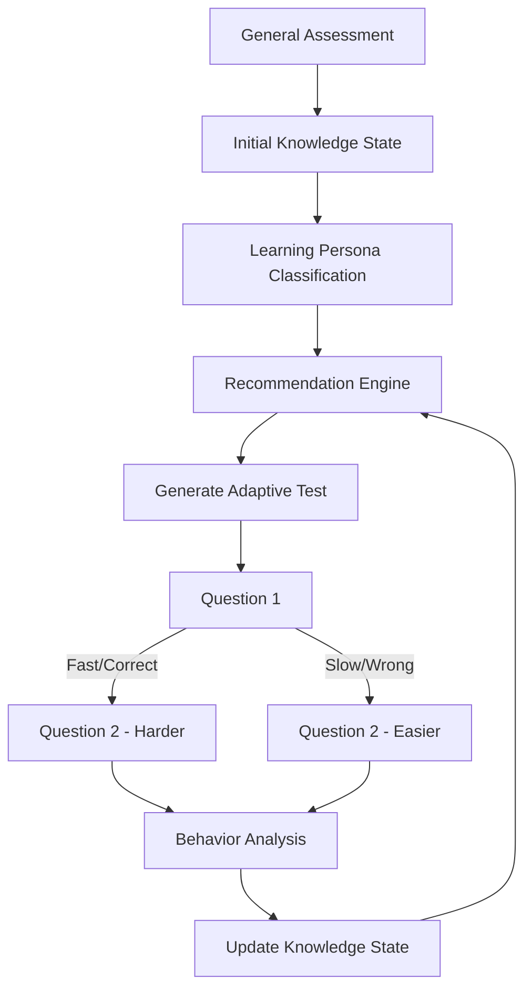
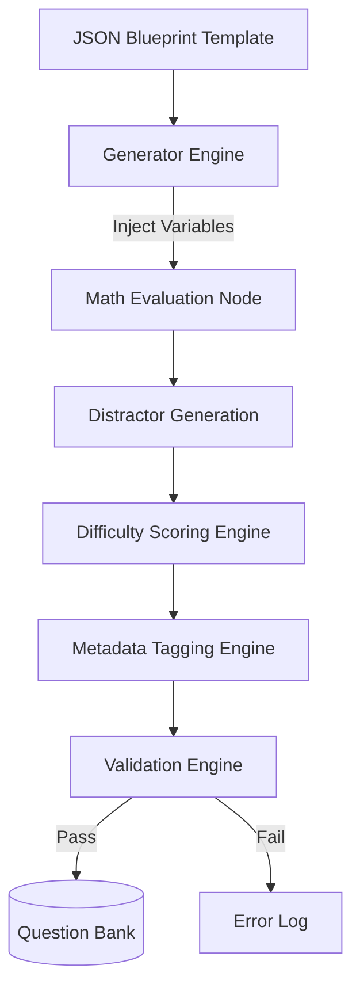
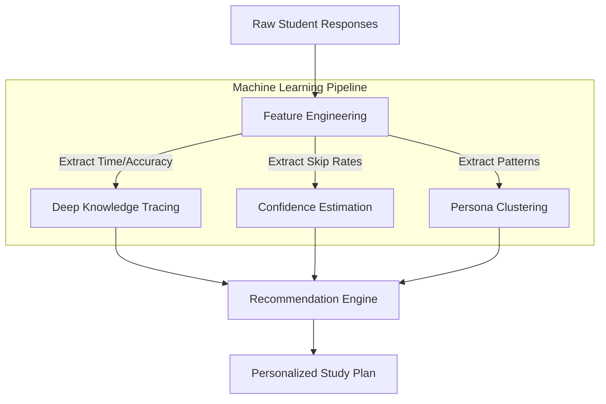

# CHAPTER 8 – SYSTEM DESIGN DOCUMENTATION

This chapter presents the architectural framework and system design of the AI-Driven Adaptive Learning Platform. It utilizes unified modeling language (UML), Data Flow Diagrams (DFD), and Entity-Relationship (ER) models to provide a comprehensive structural and behavioral view of the system.

---

## 8.1 DATA FLOW DIAGRAM (LEVEL 0)

### 1. Professional Block Diagram


### 2. Diagram Explanation
The Level 0 DFD, also known as the Context Diagram, represents the entire Adaptive Learning Platform as a single high-level process. It identifies the external entities (Student and Admin) and the overarching flow of information between them and the system.

### 3. Purpose
To define the system boundary, identify external actors interacting with the system, and establish the primary data inputs and outputs without delving into internal logic.

### 4. Components Involved
*   **External Entities:** Student, Admin
*   **Main Process:** Adaptive Learning Platform Core

### 5. Data Flow Description
Students input registration data, credentials, and test responses into the system. The system returns personalized test sessions, UI dashboards, and adaptive recommendations. Administrators input configuration data and question banks, receiving aggregated analytics and system feedback in return.

### 6. Advantages
Provides a non-technical, easily understandable overview of the system's purpose for stakeholders and high-level project presentations.

---

## 8.2 DATA FLOW DIAGRAM (LEVEL 1)

### 1. Professional Block Diagram
```mermaid
flowchart TD
    S((Student))
    A((Admin))
    
    subgraph System Modules
        Auth[Authentication Module]
        GenTest[General Test Module]
        AdapTest[Adaptive Test Module]
        RecEng[Recommendation Engine]
        DB[(Central Database)]
        Analyt[Analytics Module]
    end

    S --> |Credentials| Auth
    Auth --> |Tokens| S
    Auth --> |Verify| DB
    
    S --> |Submit Test| GenTest
    GenTest --> |Profile Init| DB
    
    S --> |Submit Answers| AdapTest
    AdapTest --> |Read/Write History| DB
    
    RecEng <-- |Fetch Profile| DB
    RecEng --> |Suggest Actions| S
    
    A --> |Manage System| DB
    DB --> |Aggregate Data| Analyt
    Analyt --> |Dashboard Views| A
```

### 2. Diagram Explanation
The Level 1 DFD decomposes the main system into its primary functional modules, showing how data routes through authentication, testing engines, recommendation layers, and the database.

### 3. Purpose
To illustrate the high-level internal routing of data and how major subsystems collaborate to fulfill the external entities' requests.

### 4. Components Involved
Student, Admin, Authentication Module, General Test Module, Adaptive Test Module, Recommendation Engine, Analytics Module, Database.

### 5. Data Flow Description
Credentials flow into Authentication for verification against the DB. Test submissions flow into their respective testing modules, which compute immediate results and store them in the Database. The Analytics and Recommendation modules asynchronously fetch this stored data to push insights back to the users.

### 6. Advantages
Identifies the primary functional areas of the codebase, aiding developers in structuring microservices or distinct application folders (e.g., controllers and services).

---

## 8.3 DATA FLOW DIAGRAM (LEVEL 2)

### 1. Professional Block Diagram


### 2. Diagram Explanation
The Level 2 DFD provides a granular view of the AI and processing engines, specifically highlighting the feedback loop during an adaptive test session and the automated blueprint question generation.

### 3. Purpose
To map the complex internal logic, algorithmic pipelines, and specific data transformations occurring within the backend services.

### 4. Components Involved
Behavior Analysis, Knowledge Tracking (DKT), Learning Persona, Recommendation Engine, Blueprint Engine, Metadata Engine.

### 5. Data Flow Description
A single test response triggers a chain reaction: it is evaluated for behavioral metrics (time, accuracy), which updates the Knowledge State. This state triggers Persona re-calculation and Recommendation generation. Concurrently, Blueprint engines feed new questions into the database to supply future tests.

### 6. Advantages
Crucial for backend developers to understand synchronous vs. asynchronous processing pipelines and database write dependencies.

---

## 8.4 SYSTEM ARCHITECTURE DIAGRAM

### 1. Professional Block Diagram
```mermaid
flowchart TB
    subgraph Presentation Layer
        R[React.js] --> T[Tailwind CSS]
        R --> C[Recharts]
    end

    subgraph Business Logic Layer
        E[Express.js] --> N[Node.js]
        JWT[JWT Auth]
    end

    subgraph AI Intelligence Layer
        KT[Knowledge Tracking]
        AE[Adaptive Engine]
        RE[Recommendation Engine]
        PE[Persona Engine]
    end

    subgraph Question Intelligence Layer
        QIE[Question Intelligence]
        BPF[Blueprint Framework]
    end

    subgraph Database Layer
        M[(MySQL / MariaDB)]
    end

    Presentation Layer <--> |Axios/REST| Business Logic Layer
    Business Logic Layer <--> AI Intelligence Layer
    Business Logic Layer <--> Question Intelligence Layer
    AI Intelligence Layer <--> Database Layer
    Question Intelligence Layer <--> Database Layer
```

### 2. Diagram Explanation
This represents an N-Tier Enterprise Architecture, strictly separating the user interface, routing logic, AI processing, and data persistence into isolated layers.

### 3. Purpose
To define the technology stack at each tier and enforce separation of concerns, ensuring high scalability and maintainability.

### 4. Components Involved
React, Express, Node.js, AI Services, MySQL.

### 5. Data Flow Description
User interactions trigger Axios HTTP requests from the Presentation Layer to the Business Layer. The Business Layer routes data to the isolated AI/Question layers for heavy computation, which then execute highly optimized SQL queries against the Database Layer.

### 6. Advantages
Promotes scalability (AI layer can be scaled independently of the web server) and enables parallel development between frontend and backend teams.

---

## 8.5 COMPONENT DIAGRAM

### 1. Professional Block Diagram
```mermaid
componentDiagram
    package "Client Devices" {
        [Student Portal]
        [Admin Portal]
    }

    package "Backend Microservices" {
        [Authentication Service]
        [Test Management Service]
        [Knowledge Tracking Service]
        [Recommendation Service]
        [Learning Persona Service]
        [Analytics Service]
        [Question Generator Service]
        [Question Intelligence Service]
    }

    database "Persistent Storage" {
        [MySQL Database]
    }

    [Student Portal] ..> [Authentication Service] : Uses
    [Student Portal] ..> [Test Management Service] : Uses
    [Admin Portal] ..> [Analytics Service] : Uses
    
    [Test Management Service] --> [Knowledge Tracking Service]
    [Knowledge Tracking Service] --> [Learning Persona Service]
    [Question Generator Service] --> [Question Intelligence Service]
    
    [Backend Microservices] --> [MySQL Database]
```

### 2. Diagram Explanation
The UML Component Diagram maps out the software components and their physical or logical dependencies within the system architecture.

### 3. Purpose
To visualize how the application is modularized and which services depend on one another, crucial for planning deployments and microservice splitting.

### 4. Components Involved
Portals, Authentication, Testing, Tracking, Recommendation, Persona, Analytics, Generation services.

### 5. Data Flow Description
Client portals depend on specific backend services via API contracts. Backend services have inter-dependencies (e.g., Test Management relies heavily on Knowledge Tracking to process results), while all ultimately depend on the persistent database component.

### 6. Advantages
Identifies tight coupling and highly dependent modules, assisting in dependency injection planning and fault-tolerance design.

---

## 8.6 ACTIVITY DIAGRAM

### 1. Professional Block Diagram


### 2. Diagram Explanation
The Activity Diagram maps the dynamic sequential flow of actions taken by a student from onboarding through the continuous adaptive learning loop.

### 3. Purpose
To model the procedural logic and business rules, explicitly showing conditional branches and operational loops.

### 4. Components Involved
Student actions, Routing logic, Assessment engines.

### 5. Data Flow Description
A linear onboarding flow branches at login based on profile existence. During testing, an internal loop continues until the adaptive test is completed, which then breaks out into recommendation generation and dashboard updating.

### 6. Advantages
Provides product managers and developers with a clear roadmap of user journeys and edge cases (e.g., what happens if a test is incomplete).

---

## 8.7 USE CASE DIAGRAM

### 1. Professional Block Diagram


### 2. Diagram Explanation
The Use Case Diagram defines the system's functional requirements from the perspective of the actors (Student, Admin) and what they can achieve within the platform.

### 3. Purpose
To establish the scope of the system and ensure all user requirements are mapped to concrete system functionalities.

### 4. Components Involved
Actors (Student, Admin), System boundaries, and specific executable Use Cases.

### 5. Data Flow Description
Students have execution rights over assessment and personal learning pathways, while Admins hold execution rights over system configuration, global monitoring, and support resolution.

### 6. Advantages
Acts as the foundational contract for feature development, ensuring no unapproved "scope creep" enters the project timeline.

---

## 8.8 MODERN ER DIAGRAM

### 1. Professional Block Diagram


### 2. Diagram Explanation
The Entity-Relationship Diagram utilizes modern crow's foot notation to illustrate the high-level database tables and their relational cardinalities.

### 3. Purpose
To design the relational database schema, ensuring data normalization and referential integrity.

### 4. Components Involved
Core entities: Users, Profiles, States, Personas, Tests, Questions, Blueprints, Recommendations, Feedback.

### 5. Data Flow Description
A User has one Profile, which links to many Knowledge States. A Test Session contains many Question History records, creating a many-to-many resolution between Users and Questions.

### 6. Advantages
Prevents data redundancy and orphan records, serving as the direct blueprint for SQL schema creation.

---

## 8.9 DETAILED ENTITY RELATIONSHIP DIAGRAM

### 1. Professional Block Diagram


### 2. Diagram Explanation
This extends the ERD by explicitly mapping primary keys (PK), foreign keys (FK), and specific column attributes essential for the AI algorithms.

### 3. Purpose
To provide Database Administrators and Backend Engineers with the exact data types and foreign key constraints required for the implementation.

### 4. Components Involved
Specific columns (e.g., `response_time_ms`, `mastery_score`) required by DKT and Behavior Analysis.

### 5. Data Flow Description
Foreign keys strictly enforce relationships. For example, `QUESTION_HISTORY` cannot exist without a valid `question_id` and `test_id`, ensuring analytical integrity.

### 6. Advantages
Enables the generation of ORM (Object-Relational Mapping) models and ensures precise indexing for database performance optimization.

---

## 8.10 SEQUENCE DIAGRAM

### 1. Professional Block Diagram


### 2. Diagram Explanation
The Sequence Diagram maps the chronological, step-by-step messaging over time between different objects when a specific scenario occurs.

### 3. Purpose
To illustrate the exact synchronous and asynchronous calls required to fulfill a complex user request, highlighting network latency points.

### 4. Components Involved
Student, Frontend Application, Backend API Router, Adaptive Engine Service, Database.

### 5. Data Flow Description
A chronological flow from top to bottom. It shows the request originating at the user, traversing the network to the API, invoking the logic layer which reads the DB, and bubbling the data back up the chain to the UI.

### 6. Advantages
Exposes potential bottlenecks (e.g., multiple synchronous database calls) allowing architects to implement caching or optimize queries before coding begins.

---

## 8.11 DEPLOYMENT DIAGRAM

### 1. Professional Block Diagram
```mermaid
graph TD
    subgraph Client Environments
        B[Web Browser / Mobile]
    end

    subgraph Cloud Infrastructure
        CDN[CDN / Edge Network]
        WS[Node.js / Express Server]
    end

    subgraph Database Hosting
        DB[(Managed MySQL Instance)]
    end

    B <--> |HTTPS| CDN
    CDN <--> |REST API| WS
    WS <--> |TCP/IP (SSL)| DB
```

### 2. Diagram Explanation
The Deployment Diagram illustrates the physical mapping of software components onto hardware nodes and cloud environments.

### 3. Purpose
To define the network architecture, hosting providers, and communication protocols securing the production environment.

### 4. Components Involved
Web Browsers, Edge Networks, Web Services, Managed MySQL.

### 5. Data Flow Description
The user accesses the platform via HTTPS through a CDN. The CDN routes API requests to the isolated backend server, which opens an encrypted SSL connection to the managed database cluster.

### 6. Advantages
Essential for DevOps and network security teams to plan firewall rules, SSL certificate placement, and scaling strategies.

---

## 8.12 ADAPTIVE LEARNING FLOW DIAGRAM

### 1. Professional Block Diagram


### 2. Diagram Explanation
A specialized workflow diagram detailing the pedagogical loop of the Adaptive Engine.

### 3. Purpose
To visualize the continuous feedback loop that drives personalization, specifically showing real-time difficulty adjustment.

### 4. Components Involved
Assessment endpoints, AI classification engines, and intra-test decision nodes.

### 5. Data Flow Description
Data perpetually cycles through an assessment and re-evaluation loop. Each answer dynamically alters the difficulty of the immediate next question, while the aggregate updates the macro knowledge state.

### 6. Advantages
Provides educators and academic stakeholders clear insight into the AI's logic, proving the platform is genuinely adaptive rather than statically randomized.

---

## 8.13 QUESTION GENERATION FRAMEWORK DIAGRAM

### 1. Professional Block Diagram


### 2. Diagram Explanation
Maps the pipeline that automatically converts static blueprint templates into hundreds of unique, psychometrically sound mathematical variations.

### 3. Purpose
To demonstrate the scalability mechanism for content creation within the platform.

### 4. Components Involved
Templates, Math Evaluators, Distractor logic, Metadata parsers, and Validation gates.

### 5. Data Flow Description
A template enters the pipeline, variables are substituted, mathematical formulas generate the correct answer and plausible distractors, AI tags the metadata, and strict validators ensure quality before database insertion.

### 6. Advantages
Ensures the system never runs out of unique questions, heavily reducing the manual labor required by administrators to populate the platform.

---

## 8.14 AI/ML WORKFLOW DIAGRAM

### 1. Professional Block Diagram


### 2. Diagram Explanation
Illustrates the data science pipeline mapping raw behavioral telemetry into structured AI insights.

### 3. Purpose
To bridge the gap between software engineering and data science, defining how raw database inputs are transformed into predictive features.

### 4. Components Involved
Feature Extractors, DKT Models, Clustering Algorithms, and the Unified Recommendation Engine.

### 5. Data Flow Description
Raw events (clicks, times, correctness) are engineered into normalized features. These features are simultaneously fed into specialized AI models. The output tensors of these models converge at the Recommendation Engine to synthesize a final personalized output.

### 6. Advantages
Highlights the sophisticated multi-model approach of the platform, suitable for high-level academic defense and research publications.

---
**End of Chapter 8**
