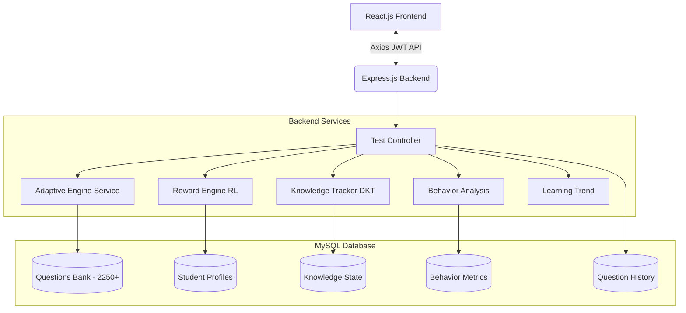
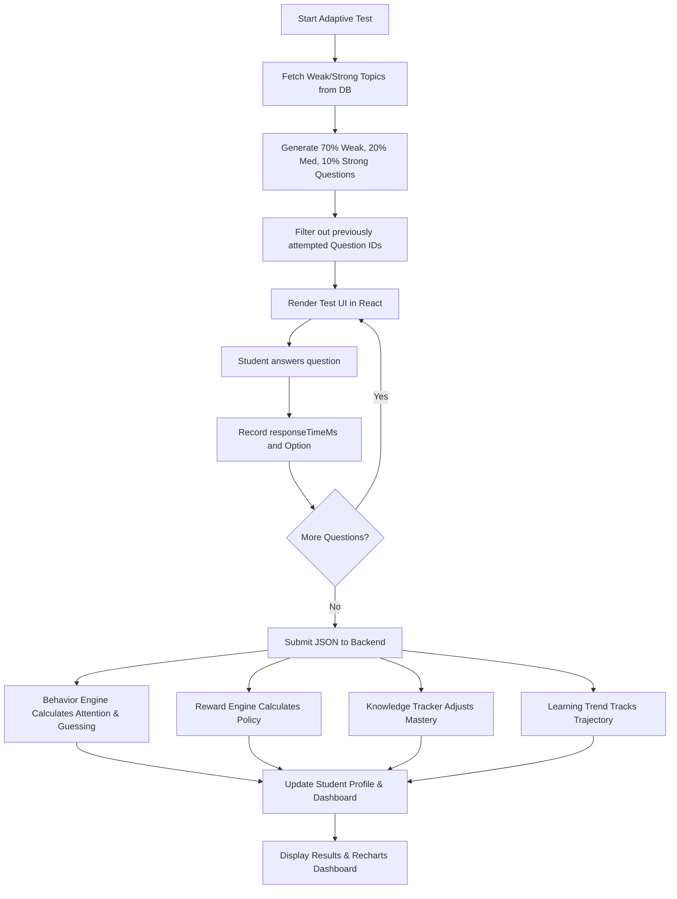

# Adaptive Learning Platform V3.0 - Complete Architecture & Execution Pipeline

This document outlines the end-to-end execution pipeline of the Adaptive Learning Platform V3.0. It is designed for your university viva, hackathon presentation, and technical interviews. It explains the integration of a mathematically driven **Deep Knowledge Tracing (DKT)** engine, a **Reinforcement Learning (RL)** engine, and a **Cognitive Behavioral Analytics Pipeline** natively within JavaScript and MySQL.

---

## 1. System Overview (V3.0 Enhancements)

The V3.0 Adaptive Learning Platform extends beyond simple correctness tracking. It evaluates not just *if* a student knows an answer, but *how* they arrive at it.

The system utilizes three primary mathematical engines:
1. **Behavioral Analysis Layer:** Tracks rapid guessing, skip rates, and attention.
2. **Bounded Knowledge Tracking Engine (DKT-inspired):** Tracks domain mastery.
3. **Behavioral Reinforcement Engine (RL-inspired):** Tracks difficulty policy.

It manages a massive programmatic dataset of **2,250+ mathematically unique questions** categorized into domains (Quantitative, Logical, Verbal), mapped against Bloom's Taxonomy, and strictly isolated using an advanced history exclusion matrix.

---

## 2. PHASE 1: Student Login & Initial State

1. **Frontend Flow:** The student enters their credentials on the React.js `LoginPage`. The `AuthContext` triggers an Axios POST request to `/api/auth/login`.
2. **Authentication:** Using `bcrypt.compare()`, the backend validates the hashed password. If successful, it generates a securely signed JSON Web Token (JWT).
3. **Student Profile Loading:** The frontend fetches `/api/dashboard`, which triggers a join across `student_profile`, `knowledge_state`, `behavior_metrics`, and `learning_trend` to populate the initial Dashboard UI.

---

## 3. PHASE 2: General Test (Baseline Establishment)

When a student logs in for the first time, the system knows nothing about them. To fix this, they are given a **General Test**.

- **Balanced Selection:** The backend queries the massive 2250+ question MySQL bank, randomly selecting 20 questions mathematically balanced across Quantitative, Logic, and Verbal domains.
- **SQL Execution:**
  ```sql
  (SELECT * FROM questions WHERE domain_id = 1 AND id NOT IN (SELECT question_id FROM question_history WHERE user_id = ?) ORDER BY RAND() LIMIT 7)
  UNION ALL
  (SELECT * FROM questions WHERE domain_id = 2 ... LIMIT 7)
  UNION ALL
  (SELECT * FROM questions WHERE domain_id = 3 ... LIMIT 6)
  ```

---

## 4. PHASE 3: During Test Attempt

As the student takes the test, React maintains an internal state array called `testResponses`.

**After every question, the system tracks:**
- `questionId`, `optionId`, `isCorrect`
- `responseTimeMs`: Exact milliseconds elapsed between render and submission.
- `wasSkipped`: Boolean flag.

No database tables are updated during the test to minimize network overhead. The array is submitted as a single massive batch payload upon completion.

---

## 5. PHASE 4: The V3.0 Continuous Evaluation Pipeline

When the student submits the test to `POST /api/tests/submit`, the backend triggers a sequential, synchronous AI pipeline:

### A. Behavior Analysis Engine (`behaviorAnalysisService.js`)
Extracts hidden cognitive telemetry from the student's test session:
- **Skip Rate:** Frequency of abandoned questions.
- **Rapid Guessing:** Answering in under 3 seconds.
- **Attention Score:** Drops heavily during continuous rapid guessing.
- **Persistence Score:** Increases when a student spends significant time on difficult questions.
- **Learning Discipline:** Evaluates test completion vs abandonment.

### B. Deep Knowledge Tracking Engine (`knowledgeTrackingService.js`)
Adjusts the bounded mastery score for every single question attempted.
- **Fluent Mastery:** Rewards students who answer correctly *and* quickly.
- **Careless Penalty:** Punishes students who answer incorrectly *and* quickly (rapid guessing).
- **Bounded Growth:** Uses `adjustment * ((100 - mastery) / 100)` to ensure that gaining mastery becomes exponentially harder as a student approaches 100%, simulating realistic skill acquisition curves.

### C. Reinforcement Reward Engine (`rewardEngineService.js`)
Evaluates the behavioral state and determines the next optimal action (difficulty shift):
- Modifies the base reward using the student's global `Consistency Score` and `Behavior Score`.
- Thresholds the aggregated reward: `> +80.0` triggers an immediate difficulty increase, while `< -30.0` triggers a regression to rebuild fundamentals.

### D. Learning Trend Engine (`learningTrendService.js`)
Provides longitudinal analysis over the last 5 test snapshots:
- Calculates the vector delta for both Accuracy and Mastery.
- Classifies the student's trajectory into distinct states: `Fast Learner`, `Improving`, `Stable`, `Slow Learner`, or `Declining`.

---

## 6. PHASE 5: Adaptive Test Generation

When the student starts an **Adaptive Test**, the AI Engine intelligently queries the DB based on the Student Profile.

1. **Identify Top Priorities:** The system pulls the user's `knowledge_state`, sorts by `mastery_score ASC`, and categorizes the bottom 33% as `weakTopics`, middle 33% as `mediumTopics`, and top 33% as `strongTopics`.
2. **Apply 70/20/10 Rule:**
   - 70% Questions are pulled from Weak Topics.
   - 20% Questions from Medium Topics.
   - 10% Questions from Strong Topics (to maintain confidence).
3. **Strict Exclusion Rule:** Every sub-query explicitly uses `AND q.id NOT IN (SELECT question_id FROM question_history WHERE user_id = ?)` to guarantee questions are never repeated.

---

## 7. Database Schema V4 (Analytics)

The MySQL architecture was expanded to support continuous tracking without violating 3NF:
- `student_profile`: Upgraded with Continuous Estimation Vectors (growth_rate, learning_trend, preferred domains).
- `behavior_metrics`: Immutable ledger of every test's cognitive behavior (attention, persistence, rapid_guessing).
- `question_statistics`: Aggregates the global skip_rate and accuracy of specific questions across the entire user base.
- `learning_trend`: Snapshot history of trajectory classifications.
- `questions`: Expanded pedagogical metadata (hints, detailed_explanation, bloom_taxonomy_level).

---

## 8. Complete Architecture Diagram



---

## 9. Logical Flowchart



---

## 10. Performance Optimizations (V3.0)
- **Frontend Code Splitting:** Implemented `React.lazy()` and `<Suspense>` to drastically reduce initial JS bundle loads.
- **Error Boundaries:** Wrapped the router to gracefully catch crashing React render cycles without blank-screening the user.
- **Backend Batch Processing:** Seeder engine utilizes chunked batch `INSERT` arrays to prevent Node.js memory overflows and MySQL `max_allowed_packet` crashes when loading 2,250+ questions.
