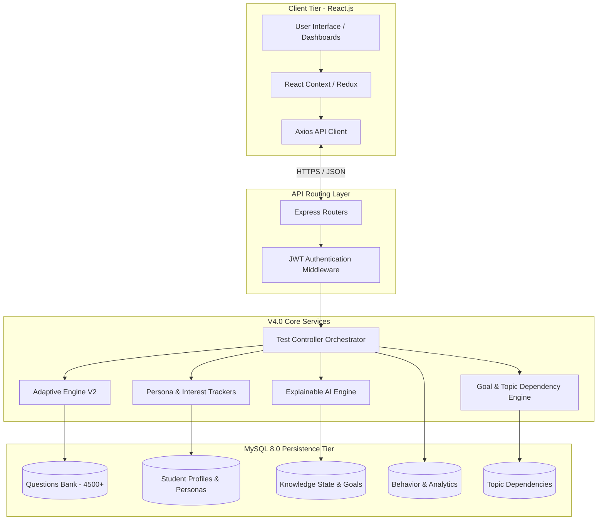
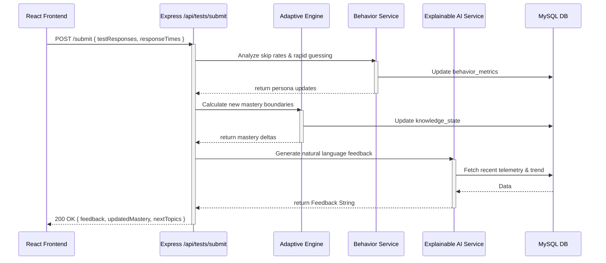
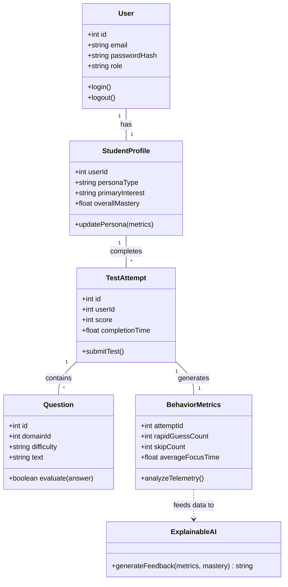

# Adaptive Learning Platform V4.0 - Complete Architecture & Execution Pipeline

This document outlines the end-to-end execution pipeline of the Adaptive Learning Platform V4.0. It is designed for your university viva, hackathon presentation, and technical interviews. It explains the integration of a mathematically driven **Deep Knowledge Tracing (DKT)** engine, a **Reinforcement Learning (RL)** engine, **Explainable AI (XAI)**, and a **Predictive Analytics Pipeline** natively within JavaScript and MySQL.

---

## 1. System Overview (V4.0 Enhancements)

The V4.0 Adaptive Learning Platform extends beyond simple correctness tracking. It evaluates not just *what* a student knows, but *who* they are as a learner, providing completely transparent, AI-driven feedback.

The system utilizes five primary mathematical engines:
1. **Behavioral & Persona Analysis Layer:** Tracks rapid guessing, skip rates, attention, and classifies students into Personas (e.g., Fast Learner, Needs Reinforcement).
2. **Bounded Knowledge Tracking Engine (DKT-inspired):** Tracks domain mastery.
3. **Topic Dependency Graph:** A strict node-based prerequisite map ensuring structural learning progression.
4. **Learning Goal Engine:** Dynamically alters difficulty trajectories based on specific student targets (e.g., GATE vs. Campus Placements).
5. **Explainable AI Engine:** Synthesizes cognitive telemetry into natural language feedback.

It manages a massive programmatic dataset of **4,500+ mathematically unique questions** categorized into domains (Quantitative, Logical, Verbal), mapped against difficulty nodes, and strictly isolated using an advanced history exclusion matrix.

---

## 2. PHASE 1: Student Login & Initial State

1. **Frontend Flow:** The student enters their credentials on the React.js `LoginPage`. The `AuthContext` triggers an Axios POST request to `/api/auth/login`.
2. **Authentication:** Using `bcrypt.compare()`, the backend validates the hashed password. If successful, it generates a securely signed JSON Web Token (JWT).
3. **Student Profile Loading:** The frontend fetches `/api/dashboard`, which triggers a massively parallel join across `student_profile`, `knowledge_state`, `learning_persona`, `student_interest`, `goal_progress`, and `learning_trend` to populate the highly visual V4 Dashboard UI.

---

## 3. PHASE 2: General Test (Baseline Establishment)

When a student logs in for the first time, the system knows nothing about them. To fix this, they are given a **General Test**.

- **Balanced Selection:** The backend queries the massive question MySQL bank, randomly selecting questions mathematically balanced across domains.
- **SQL Execution (Anti-Repetition):**
  ```sql
  (SELECT * FROM questions WHERE domain_id = 1 AND id NOT IN (SELECT question_id FROM question_history WHERE user_id = ?) ORDER BY RAND() LIMIT 7)
  ```

---

## 4. PHASE 3: During Test Attempt

As the student takes the test, React maintains an internal state array called `testResponses`.

**After every question, the system tracks:**
- `questionId`, `optionId`, `isCorrect`
- `responseTimeMs`: Exact milliseconds elapsed between render and submission.
- `wasSkipped`: Boolean flag.

No database tables are updated during the test to minimize network overhead. The array is submitted as a single massive batch payload upon completion.

---

## 5. PHASE 4: The V4.0 Continuous Evaluation Pipeline

When the student submits the test to `POST /api/tests/submit`, the backend triggers a sequential, synchronous AI pipeline:

### A. Deep Knowledge Tracking Engine (`knowledgeTrackingService.js`)
Adjusts the bounded mastery score. Uses `adjustment * ((100 - mastery) / 100)` to ensure that gaining mastery becomes exponentially harder as a student approaches 100%.

### B. Behavior Analysis Engine (`behaviorAnalysisService.js`)
Extracts hidden cognitive telemetry:
- **Skip Rate & Rapid Guessing:** Frequency of abandoned or rushed questions.
- **Attention & Persistence Score:** Increases when a student spends significant time on difficult questions.

### C. Learning Trend & Persona Engines (`learningTrendService.js`, `learningPersonaService.js`)
Evaluates longitudinal analysis over the last 5 test snapshots and dynamically shifts the student's persona (e.g., from *Adaptive Learner* to *Fast Learner*).

### D. Interest & Goal Tracking (`studentInterestService.js`, `learningGoalService.js`)
Calculates what domains the student naturally succeeds in and monitors their mathematical progress against their selected Goal Target metric.

### E. Explainable AI Engine (`explainableAIService.js`)
Instead of an opaque difficulty shift, the engine generates a natural language string analyzing the telemetry data, providing the user with direct, readable insight into *why* the algorithm is making its decisions.

---

## 6. PHASE 5: Adaptive Test Generation V2

When the student starts an **Adaptive Test**, the AI Engine intelligently queries the DB based on the complete V4 Student Profile.

1. **Calculate Ratios:** The system analyzes the student's `learning_persona` and `learning_trend`. A "Fast Learner" will get a 40/40/20 ratio of Weak/Medium/Strong questions, while a struggling student gets a 50/30/20 confidence-building split.
2. **Apply Topic Dependency:** Weak topics are checked against the `topic_dependency` graph. The system will *not* fetch a Weak topic if the student hasn't mastered its fundamental prerequisites yet.
3. **Apply Goal Difficulty:** If the student is targeting a highly competitive exam (e.g., GATE), the selection algorithm applies a mathematical bias, forcing minimum difficulty thresholds.
4. **Strict Exclusion Rule:** Sub-queries explicitly guarantee questions are never repeated using `NOT IN`.
5. **Exact Targeting:** The engine targets precisely 15 questions to prevent cognitive fatigue.

---

## 7. Database Schema V4 (Analytics)

The MySQL architecture was expanded to support continuous tracking without violating 3NF:
- `learning_persona` & `student_interest`: Categorical profiling based on dynamic metrics.
- `goal_progress`: Tracks student targets against mastery thresholds.
- `topic_dependency`: Node mapping for prerequisite graph execution.
- `question_statistics`: Advanced admin table evaluating `skip_count` and `discrimination_index` for quality control.
- `behavior_metrics` & `learning_trend`: Immutable ledgers of cognitive behavior.

---

## 8. Complete Architecture Diagram

The architecture is divided into clear micro-layers within the Express monolithic structure.



---

## 9. Comprehensive Execution Flow

The following sequence diagram outlines the exact micro-interactions that occur during the critical Phase 5 (Continuous Evaluation Pipeline).



---

## 10. System UML Class Diagram

This class diagram represents the core logical entities and services managed by the backend engine.



---

## 11. Performance Optimizations (V4.0)
- **Database Indexes:** Applied manual `CREATE INDEX` SQL constraints to foreign keys (user_ids, topic_ids) to ensure high-speed fetching across massive analytic tracking tables.
- **Frontend Code Splitting:** Implemented `React.lazy()` and `<Suspense>` to drastically reduce initial JS bundle loads.
- **Query Aggregation:** Fused the dashboard loading process into efficient concurrent `Promise.all` fetches to avoid sequential network waterfalling.
