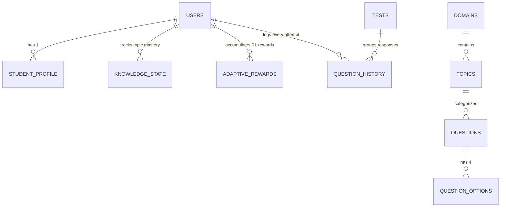
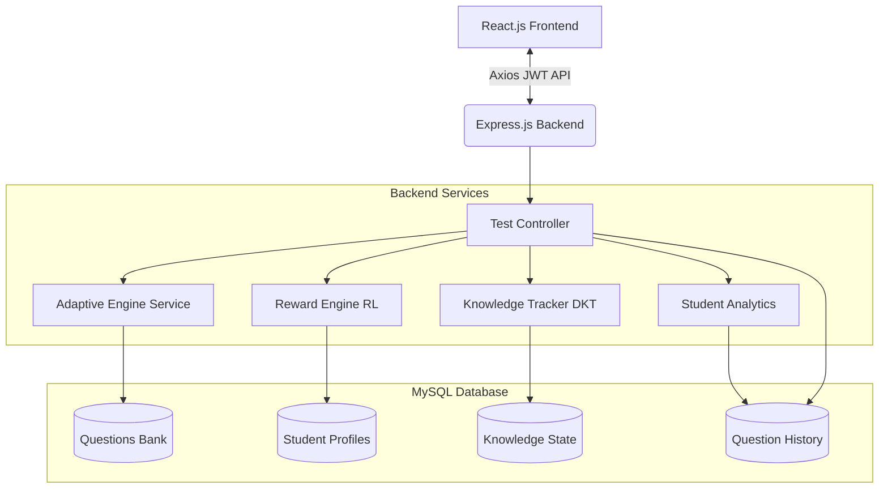
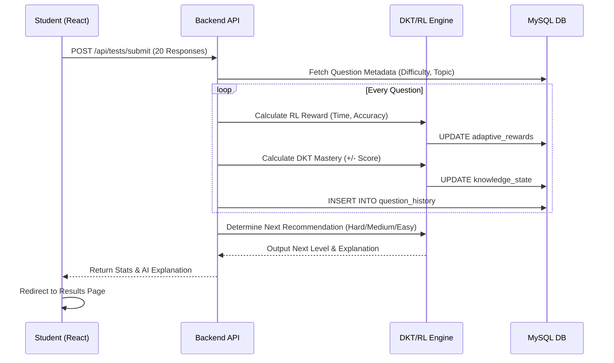
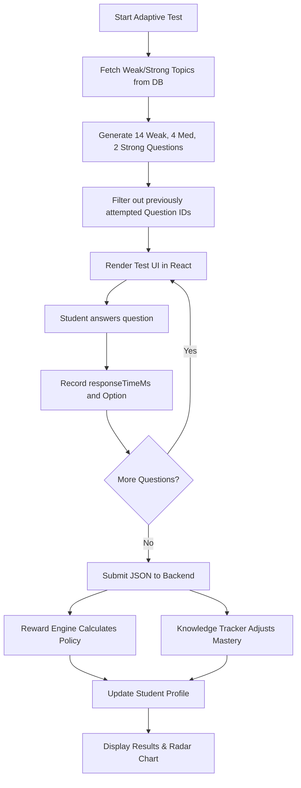

# Adaptive Learning System V2.0 - Complete Architecture & Execution Pipeline

This document outlines the end-to-end execution pipeline of the Adaptive Learning Platform, designed specifically for your university viva, hackathon presentation, and technical interviews. It explains the integration of a mathematically driven, lightweight **Deep Knowledge Tracing (DKT)** and **Reinforcement Learning (RL)** engine natively within JavaScript and MySQL.

---

## PHASE 1: Student Login

### Execution Flow
1. **Frontend Flow:** The student enters their credentials on the React.js `LoginPage`. The `AuthContext` triggers an Axios POST request to `/api/auth/login`.
2. **Backend Flow:** `authController.js` receives the payload.
3. **Database Queries:** The backend queries MySQL: `SELECT * FROM users WHERE email = ?`.
4. **Authentication:** Using `bcrypt.compare()`, the backend validates the hashed password. If successful, it generates a securely signed JSON Web Token (JWT) encapsulating the `userId` and `role`.
5. **Session Creation:** The JWT is returned to the frontend and stored in `localStorage`. The Axios interceptor automatically attaches this token as a `Bearer` header to all subsequent API calls.
6. **Student Profile Loading:** The frontend fetches `/api/dashboard`, which triggers a join across `student_profile` and `knowledge_state` to populate the initial Dashboard UI.

---

## PHASE 2: General Aptitude Test Generation

### How Questions are Fetched and Balanced
To establish a student's baseline knowledge, the system generates a **General Test**. It guarantees exactly 20 unique questions balanced perfectly across domains.
- **Quantitative:** 7 Questions
- **Logical Reasoning:** 7 Questions
- **Verbal Ability:** 6 Questions
- **Randomization:** Uses `ORDER BY RAND()` combined with `LIMIT`.

### Database & Backend Participation
- **API Called:** `GET /api/tests/generate/general`
- **Backend Service:** `testController.generateGeneralTest`
- **SQL Execution:**
  ```sql
  (SELECT * FROM questions WHERE domain_id = 1 AND id NOT IN (SELECT question_id FROM question_history WHERE user_id = ?) ORDER BY RAND() LIMIT 7)
  UNION ALL
  (SELECT * FROM questions WHERE domain_id = 2 AND id NOT IN (...) ORDER BY RAND() LIMIT 7)
  UNION ALL
  (SELECT * FROM questions WHERE domain_id = 3 AND id NOT IN (...) ORDER BY RAND() LIMIT 6)
  ```

---

## PHASE 3: During Test Attempt

### React State Management
As the student takes the test, `GeneralTest.jsx` or `AdaptiveTest.jsx` maintains an internal state array called `testResponses`.

**After every question, the system stores:**
- `questionId`: The unique ID of the question.
- `optionId`: The selected option (or `null` if skipped).
- `isCorrect`: Boolean evaluation (`!!selectedOption.is_correct`).
- `responseTimeMs`: The exact milliseconds elapsed between render and submission (tracked via `Date.now() - startTimeRef.current`).
- `wasSkipped`: Boolean flag.

At this stage, **no database tables are updated** to minimize network overhead. The array is held in React state until the final submission, OR sequentially submitted in the backend during evaluation.

---

## PHASE 4: General Test Submission

### Mathematical Calculations
Upon clicking submit, the array of responses is posted to `/api/tests/submit`.

**Calculations:**
- **Overall Accuracy:** $\text{Accuracy} = \frac{\sum \text{isCorrect}}{\text{Total Attempted}} \times 100$
- **Average Response Time:** $\text{Avg Time} = \frac{\sum \text{responseTimeMs}}{\text{Total Questions}}$
- **Domain/Topic Accuracy:** Grouped by `domain_id` and calculated identically per subset.

### Evaluation Updates
- **Strong Areas:** Topics where Accuracy > 70% and Avg Time < Estimated Time.
- **Weak Areas:** Topics where Accuracy < 50% or Skipped > 0.
- **Database Tables Updated:** `responses`, `results`, `learning_progress`.

---

## PHASE 5: Knowledge State Generation (DKT Inspired)

The system tracks knowledge without Deep Learning by using a rule-based deterministic **Knowledge Tracking algorithm** in `knowledgeTrackingService.js`.

### Knowledge Update Rules
Every student starts with a baseline `mastery_score` of 50.0 per topic.
For every question answered, the score is mathematically adjusted:
1. **Base Adjustment:** Correct answer grants $+5$, Wrong answer grants $-5$.
2. **Difficulty Multiplier:** 
   - Answering a *Hard* question correctly yields $5 \times 1.5 = +7.5$.
   - Failing an *Easy* question yields $-5 \times 1.5 = -7.5$.
3. **Time Penalty/Bonus:** 
   - Answering correctly but taking 2x the `estimated_solving_time` halves the reward ($+2.5$).
   - Skipping immediately yields $-2.0$.

### Storage
The results are mapped directly into the `knowledge_state` MySQL table:
`[user_id, domain_id, topic_id, difficulty_id, mastery_score, correct_attempts, attempts]`

---

## PHASE 6: Reward Calculation (RL Inspired)

Instead of complex Q-Tables, the system uses a Lightweight Policy Engine (`rewardEngineService.js`) to determine the student's *next* step.

### Reward Engine Formula
$$ R_q = (\text{Base} \times \text{Diff\_Multiplier}) - \text{Time\_Penalty} $$
- **Base:** $+10$ (Correct), $-5$ (Wrong), $-2$ (Skipped)
- **Time Penalty:** If $T_{taken} > T_{estimated}$, apply $-(T_{taken} - T_{estimated}) \times 0.1$

### Policy (Future Learning Influence)
The total accumulated reward from the test determines the next test's difficulty:
- **If Total Reward > +50:** Increase Difficulty (`target = hard`).
- **If Total Reward < 0:** Decrease Difficulty (`target = easy`).
- **Else:** Maintain Difficulty (`target = medium`).

---

## PHASE 7: Student Learning Profile

The `studentAnalyticsService.js` aggregates `knowledge_state` and `question_history` to construct a high-level `student_profile`.

**Stored Attributes in MySQL:**
- `overall_accuracy`: Aggregated float.
- `current_skill_level`: Enum (`novice`, `intermediate`, `advanced`).
- `knowledge_score`: The global average of all `mastery_scores`.
- `reward_score`: Sum of all `RL Rewards`.
- `weak_topics` / `strong_topics`: JSON strings determined dynamically by querying the top and bottom 3 mastery scores.

---

## PHASE 8: Adaptive Test Generation

The Adaptive Engine (`adaptiveEngineService.js`) intelligently queries the DB based on the Student Profile.

### Step-by-Step Selection
1. **Identify Top Priorities:** The system pulls the user's `knowledge_state`, sorts by `mastery_score ASC`, and categorizes the bottom 33% as `weakTopics`, middle 33% as `mediumTopics`, and top 33% as `strongTopics`.
2. **Apply 70/20/10 Rule:** For a 20 question test:
   - 14 Questions (70%) are pulled from Weak Topics.
   - 4 Questions (20%) from Medium Topics.
   - 2 Questions (10%) from Strong Topics (to maintain confidence).
3. **Exclusion Rule:** Every sub-query explicitly uses `AND q.id NOT IN (SELECT question_id FROM question_history WHERE user_id = ?)`.

### Conceptual SQL
```sql
SELECT * FROM questions 
WHERE topic_id IN (?, ?) 
AND id NOT IN (SELECT question_id FROM question_history WHERE user_id = ?) 
ORDER BY RAND() LIMIT 14;
```

---

## PHASE 9: Database Query Flow



---

## PHASE 10: Frontend Flow

1. **Student Dashboard:** `Dashboard.jsx` fires `axios.get('/api/dashboard')`. React state updates, triggering **Recharts** to draw the *Domain Mastery Radar Chart* and *Learning Progress Line Graph*.
2. **Adaptive Test Page:** `AdaptiveTest.jsx` calls `/api/tests/generate/adaptive`. It loops through the 20 returned questions sequentially. A countdown timer evaluates `responseTimeMs`.
3. **Result Page:** Upon submission, `axios.post('/api/tests/submit')` evaluates everything, recalculates RL scores, and pushes the new `metrics` and `explanation` state via React Router `navigate()`.

---

## PHASE 11: Complete Architecture Diagram



---

## PHASE 12: Complete Sequence Diagram



---

## PHASE 13: Logical Flowchart



---

## PHASE 14: Project Explanation (For Viva & Presentation)

### "How the Adaptive Learning Engine V2.0 Works"

**1. The Foundation (General Test):**
When a student logs in for the first time, the system knows nothing about them. To fix this, they are given a **General Test**. The backend queries the massive 2250+ question MySQL bank, randomly selecting 20 questions mathematically balanced across Quantitative, Logic, and Verbal domains.

**2. The Intelligent Evaluation (DKT & RL):**
When the student submits the test, our custom algorithms take over. Instead of heavy Deep Learning frameworks like TensorFlow, we use highly optimized, rule-based Node.js services. 
- The **Knowledge Tracking Service** acts like DKT. It breaks down their answers by topic (e.g., Algebra vs Grammar). If they answer quickly and correctly, their mastery score in that specific topic goes up. If they guess wildly (fast but wrong), they are heavily penalized.
- The **Reward Engine** acts like an RL policy. It accumulates a running "score". If their score breaches a threshold, the system decides their next test needs to be significantly harder.

**3. The Adaptive Loop (Adaptive Test Generation):**
When the student starts an **Adaptive Test**, the AI Engine looks at their `knowledge_state`. It explicitly targets their weaknesses, ensuring 70% of the questions generated are from their lowest mastery topics. It filters out any question they have ever seen before by cross-referencing the `question_history` table. 

**4. The Feedback Loop (Student Profile):**
Finally, all this complex data is aggregated by the Analytics Service and sent back to the React frontend. The student is presented with a beautiful `Recharts` Radar Graph mapping out their domain mastery, and a Line Graph tracking their learning progress over time. The system constantly learns, adapts, and challenges the student dynamically, resulting in a highly personalized learning trajectory.
