# ARCHITECTURE AND DESIGN DIAGRAM DOCUMENTATION

This document contains professional, academic-grade system architecture and design diagrams for the **AI-Driven Adaptive Learning Platform with Personalized Assessment and Behavioral Analytics**. It includes both Mermaid.js and PlantUML formats, along with specific explanations tailored for various academic evaluation scenarios.

---

## DIAGRAM 1: CONTEXT LEVEL DFD (LEVEL 0)

### 1. Purpose
To provide a high-level, bird's-eye view of the entire system, illustrating how external entities (Student and Admin) interact with the core platform without delving into internal complexities.

### 2. Diagram Description
The Context Level DFD (Level 0) represents the entire Adaptive Learning Platform as a single centralized process (Process 0). It maps all incoming data inputs (registration, login, test submissions, feedback) and outgoing data outputs (recommendations, performance reports, analytics) relative to the external actors.

### 3. Mermaid Code
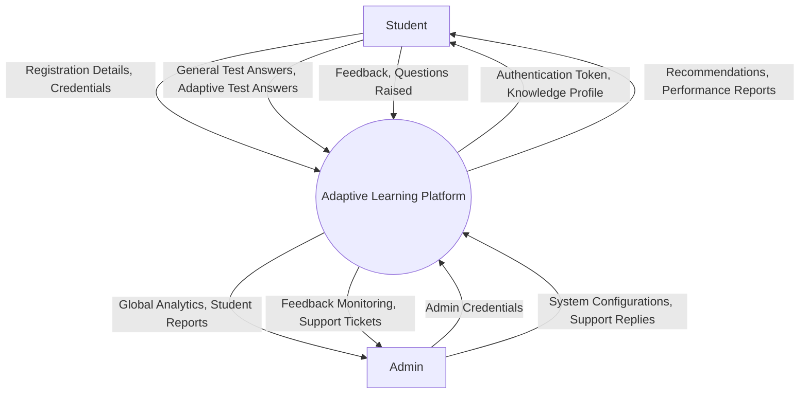

### 4. PlantUML Code
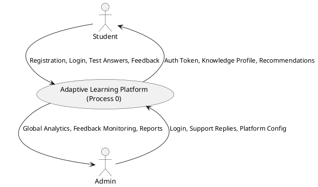

### 5. Explanation for Viva
"This Level 0 DFD defines our system boundary. As you can see, the platform sits in the center as a single abstraction. The primary data flowing in from the Student includes test responses and feedback, while the system responds with dynamic recommendations and performance metrics. The Admin acts in a supervisory capacity, consuming analytics and resolving tickets."

### 6. Explanation for Project Guide
"Sir/Madam, this context diagram ensures we have clearly identified our external boundaries. It proves that the core interaction loop—testing leading to recommendations—is fully encapsulated within the system process, isolating the end-users from the complex underlying AI engines."

### 7. Explanation for External Examiner
"The Level 0 DFD establishes the macro-architecture. By mapping the primary data vectors, we demonstrate that the platform strictly enforces role-based interactions. Students generate the behavioral data, the central process analyzes it, and both Students and Admins receive role-specific analytical outputs."

---

## DIAGRAM 2: DFD LEVEL 1

### 1. Purpose
To decompose the central Level 0 process into distinct functional sub-systems, revealing the primary data stores and the internal data flow between major platform components.

### 2. Diagram Description
The Level 1 DFD breaks down the platform into eight core processes (P1 to P8) and maps them to seven normalized data stores (D1 to D7). It illustrates the sequential data pipeline from authentication to assessment, and finally to analytics and recommendation generation.

### 3. Mermaid Code
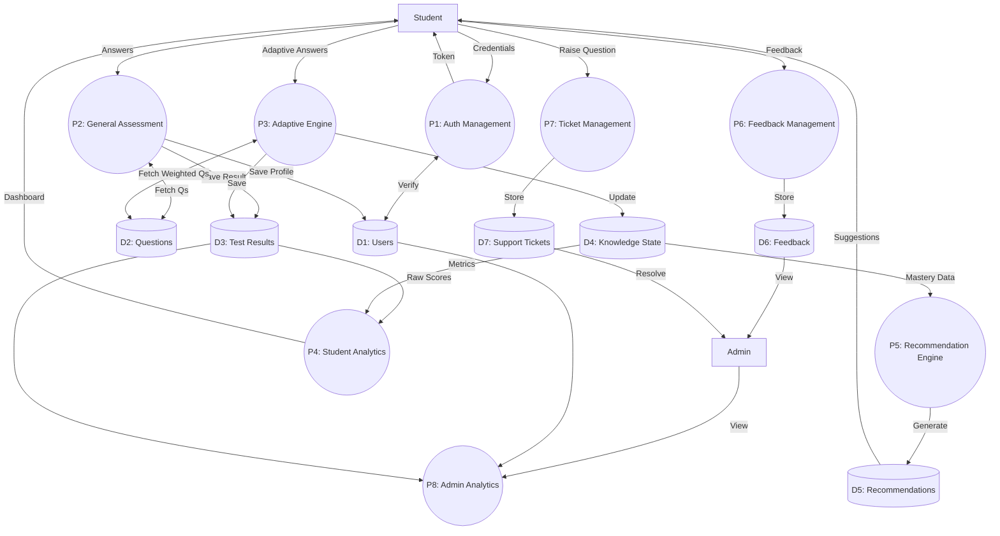

### 4. PlantUML Code
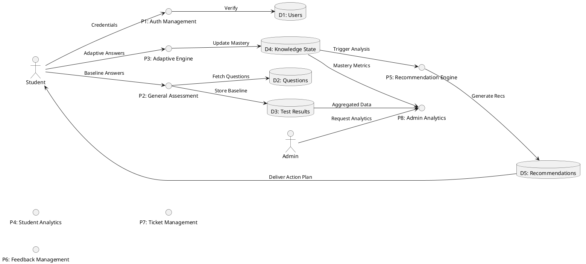

### 5. Explanation for Viva
"In Level 1, we open the 'black box'. You can trace the exact lifecycle of a student's data. Process 2 (General Assessment) generates the initial data in D3. Process 3 (Adaptive Engine) relies on D4 (Knowledge State) to fetch targeted questions. The Recommendation Engine (P5) acts as an intermediary, reading from D4 and writing to D5 for the student to consume."

### 6. Explanation for Project Guide
"This diagram maps directly to our micro-service and modular architecture design. Each circle represents a distinct backend controller or service layer. It validates our database normalization by showing exactly which process holds write-privileges to which data store."

### 7. Explanation for External Examiner
"The Level 1 DFD highlights the asynchronous, data-driven nature of the platform. By decoupling the Adaptive Engine (P3) from the Recommendation Engine (P5) using the Knowledge State (D4) as a buffer, we ensure non-blocking, highly scalable system architecture."

---

## DIAGRAM 3: DFD LEVEL 2

### 1. Purpose
To deeply analyze the most complex module of the platform—the Adaptive Learning Engine—and illustrate its internal algorithmic data flow.

### 2. Diagram Description
This Level 2 DFD explodes Process 3 (Adaptive Test Engine). It shows the micro-processes involved in calculating rewards, updating Deep Knowledge Tracing metrics, profiling the learner persona, and fetching the next optimal question.

### 3. Mermaid Code
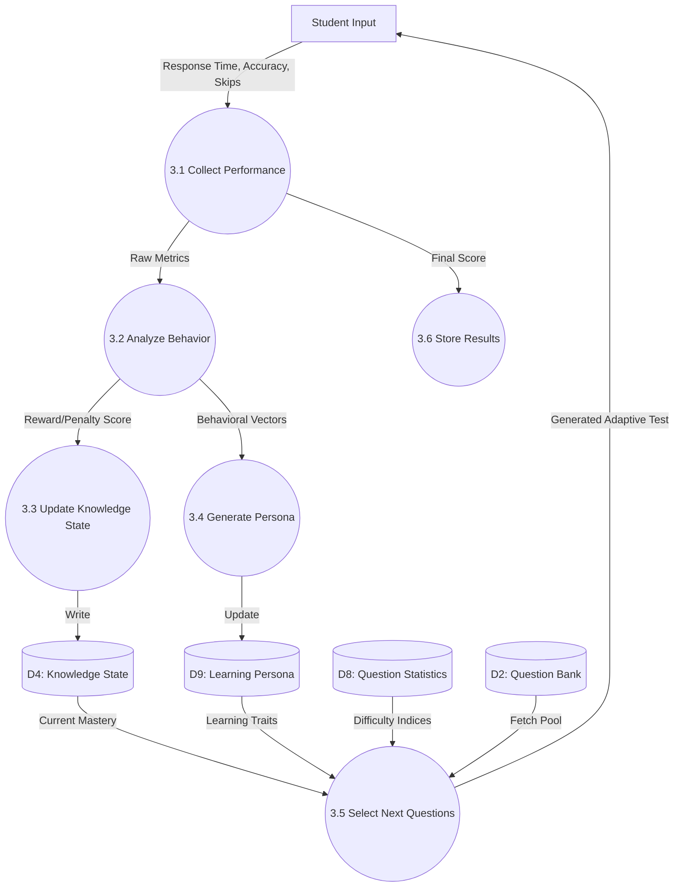

### 4. PlantUML Code
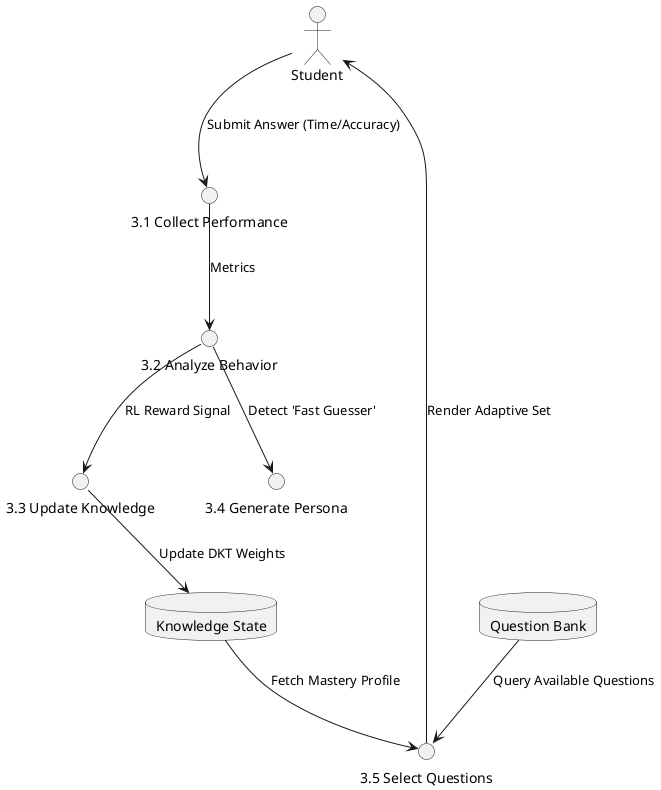

### 5. Explanation for Viva
"This Level 2 DFD is the core of our AI logic. When a student submits an answer, process 3.2 analyzes not just if it was correct, but *how long* it took. This generates a reward signal sent to 3.3 to update the Knowledge State. Process 3.5 then acts as our dynamic router, looking at the new Mastery State and querying the Question Bank for appropriately difficult questions."

### 6. Explanation for Project Guide
"This diagram proves the implementation of the Reinforcement Learning and DKT concepts. We explicitly separated the behavioral analysis (3.2) from the question selection (3.5) to maintain single-responsibility principles in our backend services."

### 7. Explanation for External Examiner
"The complexity of the adaptive algorithm is abstracted here. By treating the Knowledge State (D4) and Learning Persona (D9) as multi-dimensional vectors, Process 3.5 can execute a highly optimized query to fetch questions that strictly match the student's current cognitive threshold."

---

## DIAGRAM 4: SYSTEM ARCHITECTURE DIAGRAM

### 1. Purpose
To visually represent the physical and logical tiers of the enterprise-grade application, spanning from the client interface to the cloud infrastructure.

### 2. Diagram Description
An N-Tier Architecture diagram showcasing the Presentation Layer (React), Business Logic Layer (Node.js/Express with distinct AI microservices), Data Layer (MySQL schemas), and the underlying Infrastructure Layer.

### 3. Mermaid Code
```mermaid
graph TD
    subgraph Presentation Layer
        SP[Student Portal UI]
        AP[Admin Portal UI]
        React[React.js + Tailwind + Recharts]
        SP --- React
        AP --- React
    end

    subgraph Business Logic Layer
        API[Express.js Gateway / API]
        Auth[Authentication & JWT Service]
        GAE[General Assessment Engine]
        ALE[Adaptive Learning Engine]
        KTE[Knowledge Tracking Engine]
        LPE[Learning Persona Engine]
        QIE[Question Intelligence Engine]
        BGF[Blueprint Generator Framework]
        RE[Recommendation Engine]
        
        API --- Auth
        API --- GAE
        API --- ALE
        ALE --- KTE
        ALE --- LPE
        GAE --- RE
        QIE --- BGF
    end

    subgraph Data Layer
        DB[(MySQL / MariaDB)]
        QB[Question Bank]
        KS[Knowledge States]
        PR[Student Profiles]
        FB[Feedback & Tickets]
        
        DB --- QB
        DB --- KS
        DB --- PR
        DB --- FB
    end

    subgraph Infrastructure Layer
        Vercel[Vercel Frontend Hosting]
        Render[Render Backend Hosting]
        Aiven[Aiven Cloud Database]
    end

    Presentation Layer ==>|REST APIs / Axios| Business Logic Layer
    Business Logic Layer ==>|MySQL2 / SQL Queries| Data Layer
    
    React -.- Vercel
    API -.- Render
    DB -.- Aiven
```

### 4. PlantUML Code
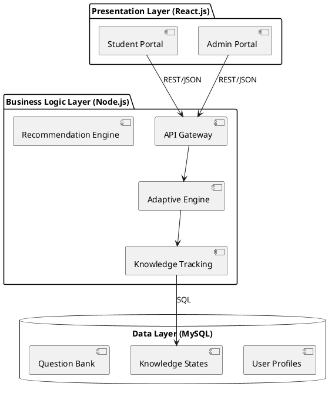

### 5. Explanation for Viva
"Our system utilizes a strict 3-tier architecture. The React frontend handles all state and rendering. The Node.js backend handles business logic and security. The MySQL database manages persistent state. They communicate exclusively via RESTful APIs and secure SQL queries, ensuring modularity."

### 6. Explanation for Project Guide
"This diagram showcases the decoupled nature of our AI components. The Knowledge Tracking Engine and Learning Persona Engine are distinct modules within the Business Layer, meaning we can upgrade the machine learning logic without disrupting the API Gateway or Presentation Layer."

### 7. Explanation for External Examiner
"The architecture is designed for horizontal scalability. Because the Business Logic layer is stateless (relying on JWTs for session management), we can deploy multiple instances of the backend on Render to handle increased concurrent load without database locking issues."

---

## DIAGRAM 5: COMPONENT DIAGRAM

### 1. Purpose
To illustrate the structural relationships, interfaces, and dependencies between the various software components in the system.

### 2. Diagram Description
This UML Component Diagram shows how the React UI components depend on the Axios HTTP client, which interfaces with the Express routing controllers. The controllers then depend on specific Service layer components (Adaptive Service, Auth Service), which interface with the MySQL connection pool.

### 3. Mermaid Code
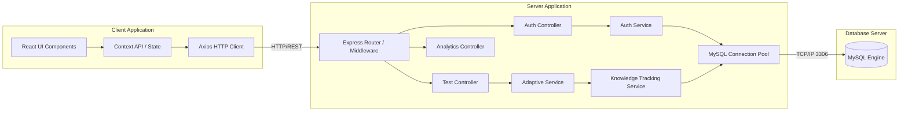

### 4. PlantUML Code
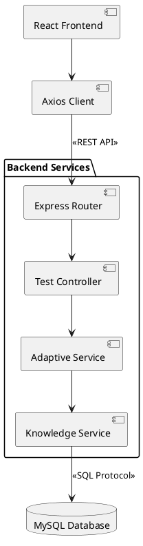

### 5. Explanation for Viva
"This component diagram shows how code is organized. The frontend uses Context API for state management and Axios for network requests. On the backend, we follow an MVC-like pattern where the Router directs traffic to Controllers, which delegate heavy logic to Services, which finally query the DB Pool."

### 6. Explanation for Project Guide
"This represents our actual directory structure (`/controllers`, `/services`, `/config/db.js`). By isolating the DB Pool component, we ensure that if we migrate from MySQL to PostgreSQL in the future, only the Service layer queries need updating, leaving Controllers untouched."

### 7. Explanation for External Examiner
"The component design enforces the Dependency Inversion Principle. Controllers do not contain business logic; they only handle HTTP request/response formatting. The actual algorithms reside in the Service components, making unit testing significantly easier and more isolated."

---

## DIAGRAM 6: ACTIVITY DIAGRAM

### 1. Purpose
To map the complete procedural flow of a student interacting with the platform, capturing decision points and parallel activities.

### 2. Diagram Description
A UML Activity Diagram tracking a student from registration through the initial assessment, the generation of their AI persona, the taking of an adaptive test, and the dynamic updating of their dashboard analytics.

### 3. Mermaid Code
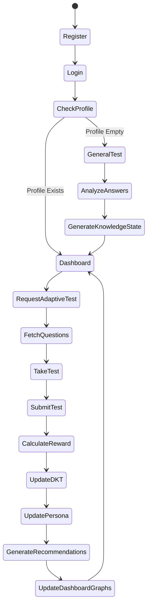

### 4. PlantUML Code
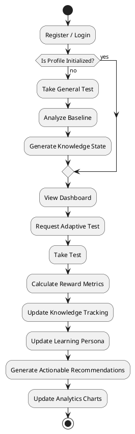

### 5. Explanation for Viva
"This activity diagram walks through the student journey. The key decision node occurs right after login. If the system detects no baseline profile, it forces the student into the General Test. Once inside the Adaptive Loop, you can see the sequential firing of our AI services: Calculate Reward, Update DKT, and Update Persona, in that exact order."

### 6. Explanation for Project Guide
"This diagram was crucial for designing our frontend routing logic. It strictly defines that a user cannot access the Adaptive Test or Dashboard without passing the 'Profile Empty' check, which is enforced via React Route Guards."

### 7. Explanation for External Examiner
"This flowchart illustrates the continuous feedback loop of the platform. The activity does not end after test submission; instead, it triggers a chain of background computational activities that refine the student's cognitive model before returning control to the Dashboard UI."

---

## DIAGRAM 7: ADMIN ACTIVITY DIAGRAM

### 1. Purpose
To detail the administrative workflows for monitoring system health, managing student progress, and addressing feedback.

### 2. Diagram Description
Maps the path of an Administrator logging in, viewing global aggregates, drilling down into individual student profiles, managing the question bank, and resolving raised tickets.

### 3. Mermaid Code
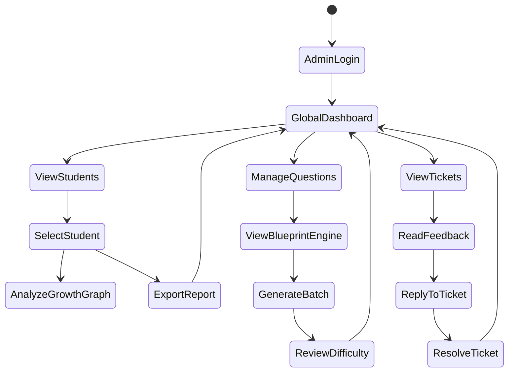

### 4. PlantUML Code
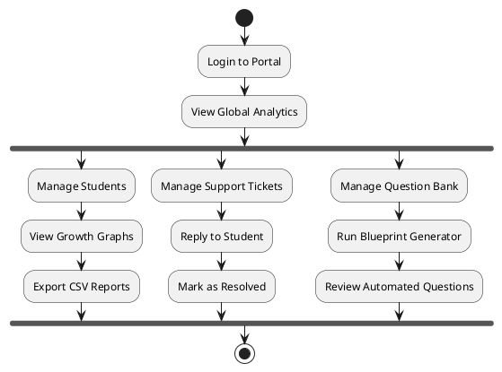

### 5. Explanation for Viva
"The Admin Activity Diagram is much more parallel than the Student diagram. From the global dashboard, the admin can branch off into monitoring analytics, resolving tickets, or generating new questions via the Blueprint framework, highlighting the multi-functional nature of the admin role."

### 6. Explanation for Project Guide
"This ensures we have built the necessary administrative CRUD (Create, Read, Update, Delete) operations. It shows that admins have the exclusive capability to trigger batch generation of questions and export reports, capabilities strictly segregated from the student flow."

### 7. Explanation for External Examiner
"This workflow emphasizes system maintainability. By providing the admin with direct pathways to monitor student risk (Growth Graphs) and platform content (Blueprint Engine), the platform includes built-in tools for continuous improvement and auditing."

---

## DIAGRAM 8: MODERN ER DIAGRAM

### 1. Purpose
To represent the normalized relational database schema, highlighting Primary Keys, Foreign Keys, and the exact constraints governing data integrity.

### 2. Diagram Description
A detailed Crow's Foot ER Diagram mapping the 12 core tables of the system, including associative entities for many-to-many relationships and historical tracking.

### 3. Mermaid Code
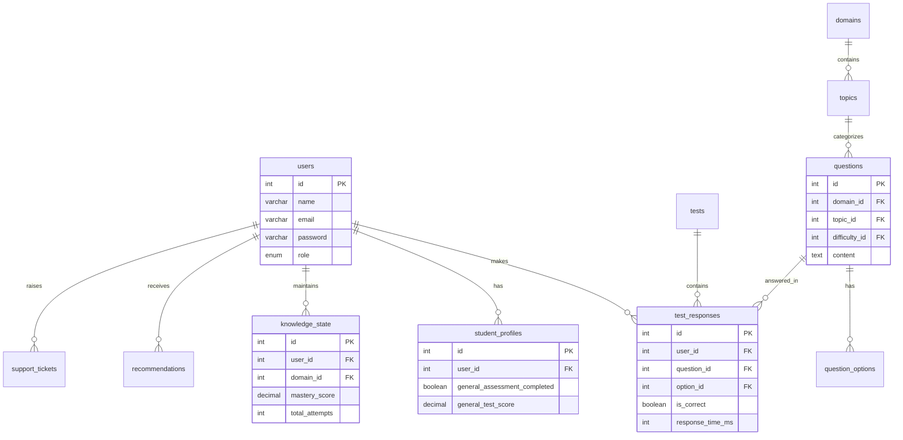

### 4. PlantUML Code
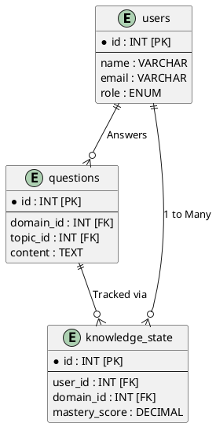

### 5. Explanation for Viva
"Our Modern ER Diagram uses Crow's foot notation. The most critical relationship is between `users` and `knowledge_state`. It is a One-to-Many relationship because one user has multiple knowledge state records (one for each domain/topic), which allows the system to track mastery at a granular level."

### 6. Explanation for Project Guide
"This schema is heavily normalized to 3NF (Third Normal Form) to prevent data anomalies. Questions are separated from Options, and Domains are separated from Topics, utilizing Foreign Keys to enforce referential integrity."

### 7. Explanation for External Examiner
"The database design prioritizes the analytics pipeline. By logging `response_time_ms` and `is_correct` in the highly atomic `test_responses` table, the AI engines can asynchronously scan this table to recalculate Deep Knowledge Tracing metrics without altering the core user table."

---

## DIAGRAM 9: ENTITY RELATIONSHIP DIAGRAM

### 1. Purpose
To provide a traditional, conceptual view of the entities and their semantic relationships, focusing on business concepts rather than SQL specifics.

### 2. Diagram Description
A conceptual ERD showing entities like Student, Question, Test, and Persona, linked by verbs (Takes, Generates, Contains) to illustrate the business rules.

### 3. Mermaid Code
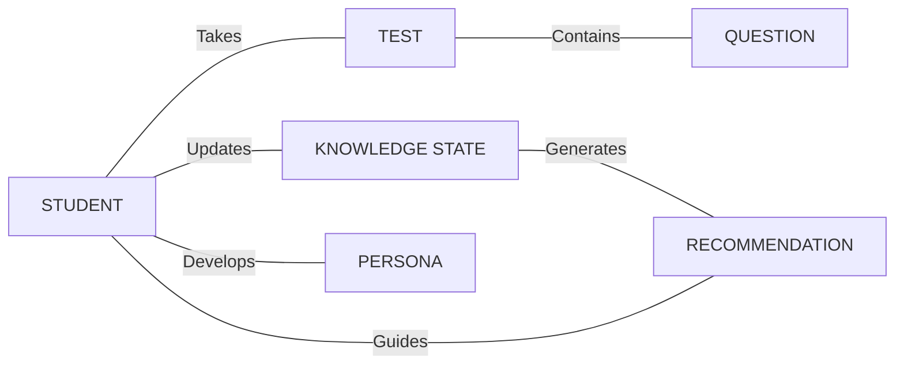

### 4. PlantUML Code
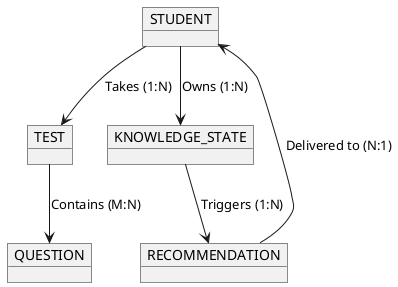

### 5. Explanation for Viva
"This conceptual ERD simplifies the technical schema into business logic. A Student takes multiple Tests. A Test contains multiple Questions. Crucially, the Student's performance updates their Knowledge State, which in turn triggers Recommendations back to the Student, completing the learning cycle."

### 6. Explanation for Project Guide
"This diagram is useful for explaining the project to non-technical stakeholders. It removes the clutter of primary keys and integer IDs, focusing purely on the platform's value proposition: connecting student performance to actionable recommendations."

### 7. Explanation for External Examiner
"The semantic ERD highlights the cardinalities that drive the system. The Many-to-Many relationship between Tests and Questions (resolved by a junction table in the physical schema) is what allows the Adaptive Engine to dynamically generate infinite unique test combinations from a finite question pool."

---

## DIAGRAM 10: SEQUENCE DIAGRAM

### 1. Purpose
To illustrate the chronological sequence of messages and API calls passed between objects during the most critical operation: Taking an Adaptive Test.

### 2. Diagram Description
A UML Sequence Diagram detailing the timeline from a student clicking "Start Test", the backend querying the ML models, the database fetching questions, the user submitting answers, and the dashboard rendering updated graphs.

### 3. Mermaid Code
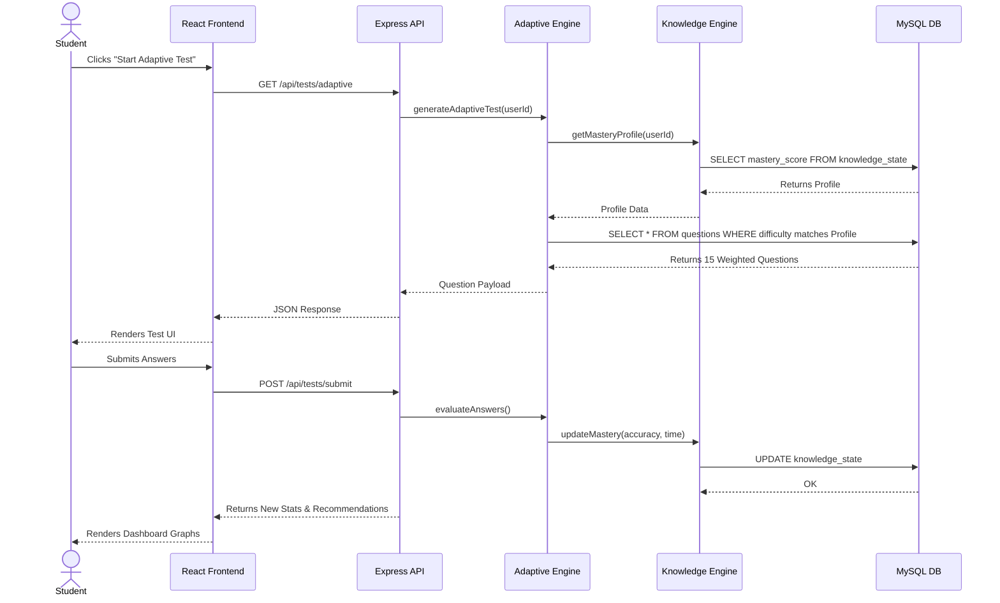

### 4. PlantUML Code
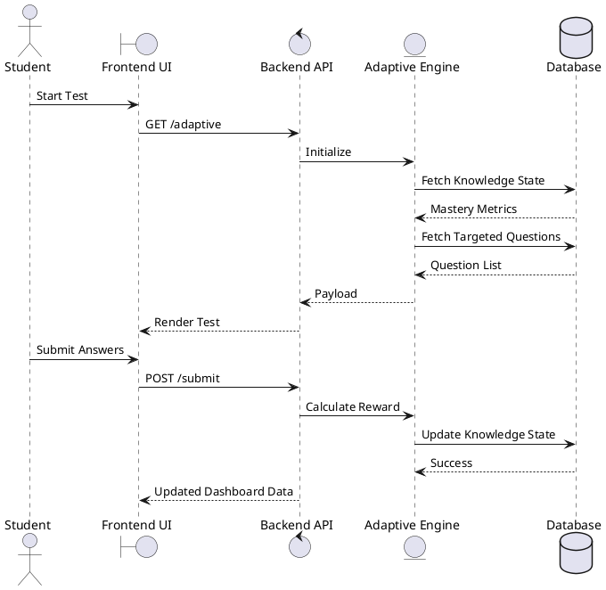

### 5. Explanation for Viva
"This Sequence Diagram reads top-to-bottom as time progresses. The most important phase is when the Adaptive Engine pauses to request the Mastery Profile from the Knowledge Engine *before* it asks the Database for questions. This sequence proves the test is dynamically generated based on real-time data, not pre-compiled."

### 6. Explanation for Project Guide
"This diagram perfectly illustrates the synchronous and asynchronous operations in our Node.js backend. The UI waits asynchronously (`await`) while the API makes multiple internal service calls and database queries before finally returning the JSON response."

### 7. Explanation for External Examiner
"The sequence diagram highlights the statelessness of the HTTP requests. All context required to generate the test is derived dynamically from the database using the `userId` extracted from the JWT token, ensuring secure, personalized execution."

---

## DIAGRAM 11: USE CASE DIAGRAM

### 1. Purpose
To define the system's functional requirements and interactions from the perspective of the distinct actors (Student and Admin).

### 2. Diagram Description
A UML Use Case Diagram showing the boundaries of the system, with the Student actor on the left executing learning-focused use cases, and the Admin actor on the right executing management-focused use cases.

### 3. Mermaid Code
```mermaid
usecaseDiagram
    actor Student
    actor Admin

    rectangle "Adaptive Learning Platform" {
        usecase "Register & Login" as UC1
        usecase "Take General Assessment" as UC2
        usecase "Take Adaptive Test" as UC3
        usecase "View Knowledge Analytics" as UC4
        usecase "Receive Recommendations" as UC5
        usecase "Submit Feedback/Tickets" as UC6
        
        usecase "Monitor Global Analytics" as UC7
        usecase "Manage Question Blueprint" as UC8
        usecase "Resolve Support Tickets" as UC9
    }

    Student --> UC1
    Student --> UC2
    Student --> UC3
    Student --> UC4
    Student --> UC5
    Student --> UC6

    Admin --> UC1
    Admin --> UC7
    Admin --> UC8
    Admin --> UC9
```

### 4. PlantUML Code
```plantuml
@startuml
left to right direction
actor Student
actor Admin

package "Adaptive Platform" {
  usecase "Take Tests" as UC1
  usecase "View Analytics" as UC2
  usecase "Get Recommendations" as UC3
  
  usecase "Manage Blueprint Engine" as UC4
  usecase "View Global Stats" as UC5
  usecase "Resolve Tickets" as UC6
}

Student --> UC1
Student --> UC2
Student --> UC3

Admin --> UC4
Admin --> UC5
Admin --> UC6
@enduml
```

### 5. Explanation for Viva
"The Use Case Diagram defines exactly *what* the system does. The Student's primary use cases resolve around the learning loop: testing, viewing analytics, and getting recommendations. The Admin's use cases focus on platform health: monitoring stats, generating content via Blueprints, and providing support."

### 6. Explanation for Project Guide
"We used this diagram early in the SDLC to define our development sprints. The Student use cases formed the MVP (Minimum Viable Product), while the Admin use cases like the Blueprint Engine were developed in later iterations."

### 7. Explanation for External Examiner
"This diagram enforces the strict separation of concerns within the platform interface. There is zero overlap between the core computational use cases of the student and the managerial use cases of the admin, ensuring data privacy and role-based security."

---

## DIAGRAM 12: DEPLOYMENT DIAGRAM

### 1. Purpose
To illustrate the physical deployment architecture, detailing where software components reside on hardware/cloud nodes and how they communicate across networks.

### 2. Diagram Description
A UML Deployment Diagram showing the User's device running a web browser, communicating over HTTPS to the Vercel-hosted React app, which talks via REST/HTTPS to the Render-hosted Node container, which connects via TCP/IP to the Aiven Cloud MySQL cluster.

### 3. Mermaid Code
```mermaid
graph TD
    subgraph Client Device
        Browser[Web Browser : Mobile/Desktop]
    end

    subgraph Vercel Cloud Edge
        ReactApp[Frontend : React Static Build]
    end

    subgraph Render Cloud Container
        NodeServer[Backend : Node.js/Express Server]
    end

    subgraph Aiven Cloud Cluster
        MySQLDB[(Database : MySQL 8.0)]
    end

    Browser <==>|HTTPS / Port 443| ReactApp
    ReactApp <==>|HTTPS / REST API / Axios| NodeServer
    NodeServer <==>|TCP/IP / Port 16380 / TLS| MySQLDB
```

### 4. PlantUML Code
```plantuml
@startuml
node "Client Device" {
  artifact "Web Browser"
}

node "Vercel CDN" {
  artifact "React Build Assets"
}

node "Render Platform" {
  artifact "Node.js Container"
}

node "Aiven Cloud" {
  database "MySQL Cluster"
}

"Client Device" ..> "Vercel CDN" : HTTPS
"Vercel CDN" ..> "Render Platform" : REST APIs (HTTPS)
"Render Platform" ..> "Aiven Cloud" : TCP/IP (TLS Secured)
@enduml
```

### 5. Explanation for Viva
"Our deployment diagram shows a fully cloud-native, distributed infrastructure. The frontend is deployed on Vercel's global CDN for extremely fast load times. The backend runs in a Dockerized container on Render, and the database is hosted securely on Aiven's cloud, communicating via a secure TLS connection."

### 6. Explanation for Project Guide
"This topology demonstrates modern DevOps practices. By physically separating the frontend, backend, and database onto specialized hosting providers, we ensure that a failure in the web UI does not crash the database, guaranteeing high availability."

### 7. Explanation for External Examiner
"The deployment architecture relies heavily on HTTPS and TLS encryption across all nodes. The communication between the Node.js server and the MySQL database uses connection pooling and SSL rejection handling, ensuring that sensitive behavioral data is never transmitted in plain text across the public internet."
