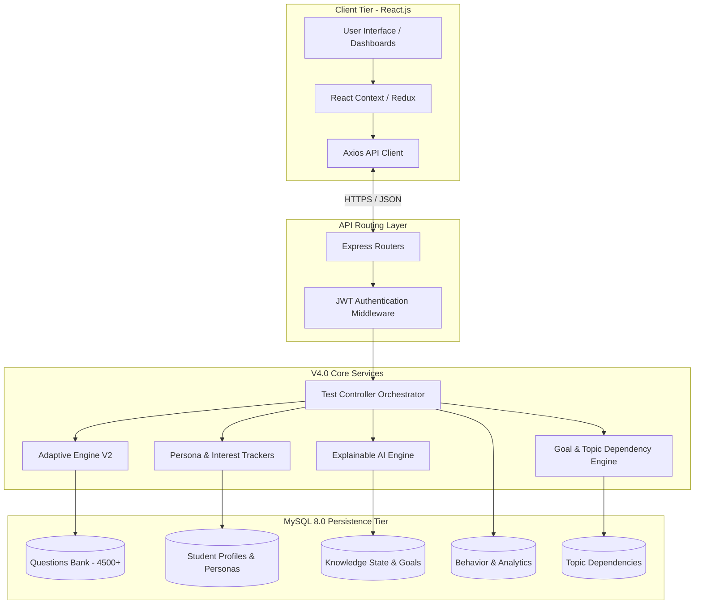
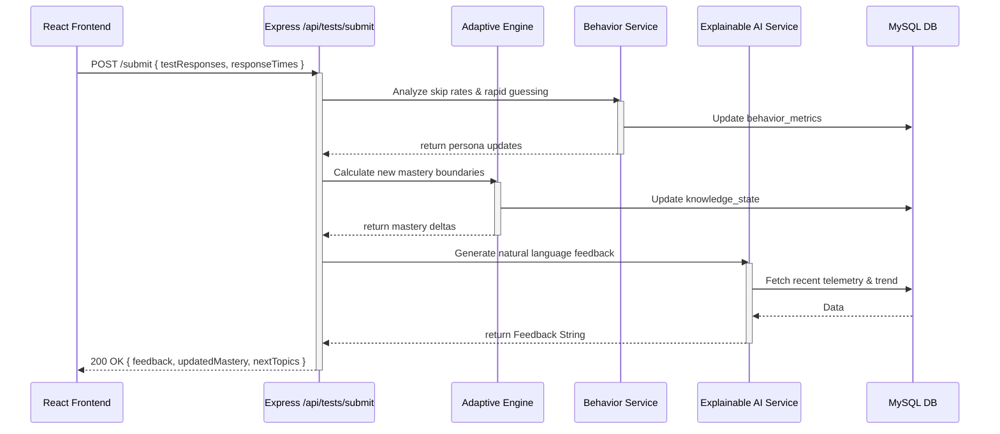
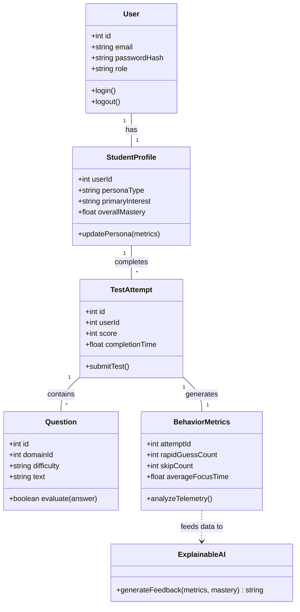

# Adaptive Learning Platform V4.0 Implementation Plan

This plan documents the systematic upgrade of the Adaptive Learning Platform from V3.0 to Version 4.0. The upgrade focused on deeply integrated predictive analytics, Explainable AI, robust Goal tracking, and an overhauled Question Quality Engine, while maintaining strict backward compatibility with the existing React/Node.js/MySQL tech stack.

## Final Execution Status: **COMPLETED**
All modules and execution phases outlined below have been successfully implemented and deployed to the local XAMPP/Node.js environment.

---

## Execution Strategy (Module-by-Module)

### Module 1: Student Modeling & Profiling (Completed)
- **Objective:** Broaden the learning engine to track *who* the student is, not just *what* they know.
- **Components Implemented:**
  - **Learning Persona Engine**: Classifies students dynamically (e.g., Fast Learner, Needs Reinforcement, Methodical) based on accuracy and speed metrics.
  - **Student Interest Tracking**: Monitors which domains a student naturally gravitates toward or succeeds in.
  - **Confidence Estimation Model**: Analyzes rapid guessing vs. long pauses to calculate an internal confidence score.

### Module 2: The Core Analytical Engines (Completed)
- **Objective:** Improve the backend recommendation pipeline with deep learning insights.
- **Components Implemented:**
  - **Question Quality Analytics (Admin)**: Tracks skipped metrics, calculates a `discrimination_index`, and highlights Most Difficult, Confusing, Unused, and Frequently Skipped questions.
  - **Topic Dependency Graph**: Enforces a prerequisite map (e.g., mastery in Number System required before advancing to Arithmetic).

### Module 3: Explainable AI & Goal Tracking (Completed)
- **Objective:** Give the system transparency and target orientation.
- **Components Implemented:**
  - **Explainable AI Engine**: Rather than black-box recommendations, the system generates natural language feedback (e.g., "You answered 2/5 hard questions correctly but spent an average of 42s. Recommend reviewing Medium difficulty").
  - **Learning Goal Engine**: Students can select specific exam targets (e.g., GATE, CAT, Campus Placement). The adaptive difficulty automatically biases its calculations based on the aggressiveness of the goal.
  - **Continuous Improvement Loop**: A pipeline orchestrated in `testController.js` that seamlessly updates all 7 statistical layers in one synchronized flow after test submission.

### Module 4: Adaptive Generation & Visual Dashboards (Completed)
- **Objective:** Overhaul test generation and visual UI to fully utilize the V4 predictive engines.
- **Components Implemented:**
  - **Question Selection Engine V2**: Refactored the `adaptiveEngineService.js` to intelligently fetch exactly 15 questions by fusing the user's Persona, Goal, Trend, Confidence, and Weak/Strong ratio.
  - **Dashboard V2 (Student)**: Completely rebuilt `StudentDashboard.jsx` featuring dynamic modular widgets for Persona, Interest, Goal Progress, Knowledge Radar, and a Learning Roadmap.
  - **Dashboard V2 (Admin)**: Updated `AdminDashboard.jsx` to natively display the Question Analytics metrics.
  - **Database Consolidation**: Fused all legacy schemas and V4 extensions into a single master file (`schema_v4_final.sql`) containing over 4,500 questions.

### Module 5: Codebase Optimization & Diagrammatic Architecture (Completed)
- **Objective:** Finalize the repository for deployment by removing obsolete boilerplate and providing exhaustive diagrammatic documentation.
- **Components Implemented:**
  - **Dead Code Elimination**: Ran `depcruise/unimported` logic to clear out 16 obsolete seeding scripts and legacy V2 generation engines from the backend.
  - **System UML Generation**: Formalized the domain models into Mermaid UML.
  - **Execution Flow Maps**: Created explicit Sequence Diagrams for the Continuous Evaluation Pipeline.

---

## 1. Complete Architecture Diagram

The architecture is divided into clear micro-layers within the Express monolithic structure.

---

## 2. Comprehensive Execution Flow

The following sequence diagram outlines the exact micro-interactions that occur during the critical Phase 5 (Continuous Evaluation Pipeline).

---

## 3. System UML Class Diagram

This class diagram represents the core logical entities and services managed by the backend engine.

